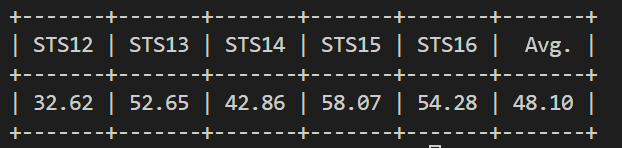

# Sentence Embedding Extraction with Large Language Models (LLMs)

Author: Yibin Lei - [IRLab @ UvA ](https://irlab.science.uva.nl/)

While large language models have shown significant progress in various natural language processing tasks, such as question answering, their ability to represent text as embeddings that capture the meaning of sentences remains underexplored. Text embeddings have a wide range of applications, including semantic textual similarity, passage retrieval, and text clustering. In this challenge, we focus on extracting sentence embeddings from LLMs by evaluating their performance on semantic textual similarity (STS) tasks. STS tasks involve determining the similarity between two pieces of text using the extracted embeddings. The performance is measured by comparing the model-predicted similarities with human-annotated similarities.

## Setup

### Conda Environment

``` bash
conda env create -n sent_emb 
pip install -r requirements.txt
conda activate sent_emb
```


### Data
We use the STS datasets. The datasets can be downloaded with 
``` bash
cd data
bash download_dataset.sh
cd -
```

The STS datasets are then downloaded into the folder `./data/STS`. We will use the STS 12-16 datasets as testbeds.

Each STS dataset consists of two files: an input file (e.g., STS.input.MSRpar.txt) and a gold score (gs) (e.g., STS.gs.MSRpar.txt) file. The input file stores the sentence pairs (e.g., "the problem likely will mean corrective changes before the shuttle fleet starts flying again." and "he said the problem needs to be corrected before the space shuttle fleet is cleared to fly again."). The gs file contains the corresponding similarity scores (ranging from 0 to 5) annotated by humans.

Your extracted embeddings are evaluated by assessing how similar your model-predicted similarity scores are to the human-annotated scores (by Spearman correlation scores).

## Data loader and evaluator
In `./src/dataset.py`, we provide a class STSEval that allows you to load STS datasets and evaluate your extracted embeddings. Specifically, the `loadFile()` function loads the sentence pairs and gold scores, while the `run()` function obtains the embeddings and evaluates them.

## Baseline Running
In `./src/baseline.py`, we provide a simple baseline that obtains the sentence embedding by averaging the last hidden states of all tokens of a sentence (average pooling) from the Llama3-8B model. 

Run the code simply with 
```  bash
python src/baseline.py
```
can get the results of the average pooling embedding extraction method with the Llama3-8B model shown like:



## The LLM-STS Challenge!
Now for the challenge! In this task, we will explore how to obtain sentence embeddings more effectively directly from LLMs out of the box without any additional training! You can modify the batcher() function in `./src/baseline.py` to implement your own embedding extraction method. Here are some potential tricks you can use to improve your embeddings with *INPUT* indicating the input sentence:

### [PromptEOL](https://arxiv.org/abs/2307.16645)
PromptEOL is a prompting method that applies a simple prompt: *This sentence "INPUT" means in one word: "* and uses the output hidden state of the last token as the sentence embedding.
### [MetaEOL](https://arxiv.org/abs/2402.18458)
Instead of using a single simplistic prompt, MetaEOL encourages the model to generate more comprehensive embeddings through multiple meta-task prompts. Explore the best set of meta-tasks for STS!
### Model ensembling
Will embeddings from different LLMs complement each other?
### [Echo embeddings](https://arxiv.org/abs/2402.15449)
Autoregressive LLMs face the problem of lacking backward dependency. Echo embeddings address this by repeating the input and extracting the sentence embedding from the embeddings of the second occurrence.
### [In-context learning](https://arxiv.org/abs/2307.16645)
In-context learning is a new paradigm that improves the model by incorporating labeled data into the input text. This method does not require fine-tuning. How can we develop the best in-context learning demos and formats for STS tasks?
### [Chain-of-thought prompting](https://arxiv.org/abs/2201.11903)
How can CoT help embedding extraction? Would generating a chain of thought and then extracting the embedding be useful?
### [Contrastive prompting](https://arxiv.org/abs/2311.09277)
You need bad demos to provide more detailed information on what the model needs to do for embedding extraction!
### [Sparse representation](https://arxiv.org/abs/2107.05720)
Map your dense hidden states into sparse, vocab-size vectors! Sparse vectors are more interpretable, but can they be more effective for STS tasks?
### Different layers
Will the outputs of the last layer be the most effective ones for STS tasks?
### Raw language models or instruction-tuned models: which one is better?
### [DSPy](https://arxiv.org/abs/2310.03714)
If you want automatic prompt optimization, try DSPy! (But note it may take some time to get familiar with DSPy.)
### Or other interesting methods you have in your mind! 


## Find questions? Contact Yibin! 

## Acknowledgement
The code is based on [PromptEOL](https://github.com/kongds/scaling_sentemb).
